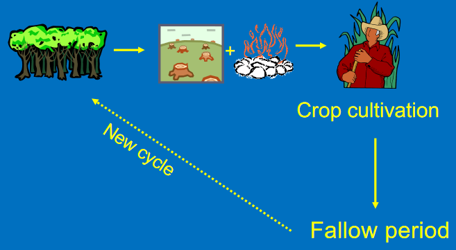

- [[social-ecological systems]] - SES concept was first coined in an interdisciplinary research project at the Beijer Institute of Ecological Economics in 1998, referred to as "the [[linking-project]]" (Dynamics of Ecosystem-Institution Linkages for Building Resilience).
	- 
	- The purpose of the linking-project is to analyse critical linkages in social-ecological systems, and to generate insights on how to interpret, respond to, and manage feedbacks from complex adaptive systems (_e.g_. ecosystems).
		- The long-term objective was to improve resource management.
	- Publications on SES
		- Berkes, F., & Folke, C. (Eds.). (1998). Linking social and ecological systems: Management practices and social mechanisms for building resilience (Transferred to digital printing). Cambridge Univ. Press.
			- Case studies about how local societies build resilience in local natural resource systems through management practices, local institutions and other social mechanisms.
		- Berkes, F., Colding, J., & Folke, C. (2003). Navigating social-ecological systems building resilience for complexity and change. Cambridge University Press.
	- [[social-ecological systems]] - social-ecological system consists of a set of critical, natural, socioeconomic, and cultural resources (or, capitals) whose flow and use is regulated by a combination of ecological and social systems (Redman et al. 2004), including technologies of which urban form could be seen as a soft technology (Marcus and Koch 2016; Colding et al. 2020).
	- In the future, SES should also include environmental psychology issues, addressing change of human behaviour and present-day life styles to combat climate change.
	- Social-ecological worldview
		- 
	- Ecological economics
		- 
		- Economy is a subset of a larger system.
- Socio-ecological versus social-ecology
	- Berkes and Folke used the term social-ecological, rather than socio-ecological, because “social-ecological emphasises that the two subsystems
	  id:: 61bc3954-dc0d-4a50-9a88-b433d03c5e08
	  are equally important, whereas socio- is a modifier, implying a less than equal status of the social subsystem (Berkes 2017:3).
	- When Carl Folke and Fikret Berkes developed the first SES framework it was primarily used for addressing how institutional resilience can be combined with ecological resilience for mutual benefit (Folke and Berkes 1998).
	- In particular, the focus was on local management
	  systems that had not been dominated by conventional resource management and that had maintained practices for the building of resilience in local settings. Most cases dealt with were local common property systems.
- [[resilience]] - ability of a social-ecological system to buffer change and/or disturbance
- [[institutions]] - rules and norms of society and their enforcement characteristics, institutions determine when, where, how, and how much resources can be taken
- Traditional natural resource management.
	- Focus of the [[linking-project]] was to study small-scale societies that have survived over long time periods through resource management that builds resilience in interlinked social-ecological systems.
		- Objective
			- insights on design principles for sustainable resource management.
		- frame of analysis
			- 
		- basic findings from the [[linking-project]] #berkesRediscoveryTraditionalEcological2000
			- management practices that build resilience
			  in social-ecological systems
				- practices also found in conventional resource management:
					- monitoring resource abundance and ecosystem change
					- total protection of certain species
					- protection of specific habitats
					- temporal restrictions of harvest
				- practices largely abandoned in conventional resource management:
					- multiple species management
						- [[polyculture]] - cultivation of multiple species of crops on the same piece of land
							- 
							- no use of fertilisers, pesticides, and field machinery
							- reduces the risk of total crop failure
							- promotes water conservation in the soil
							- reduces soil erosion and insect pests
					- resource rotation
						- 
					- succession management
						- shifting cultivation/swidden cultivation
							- 
							- common in all tropical regions
							- covers 30% of the world's exploitable soils
							- promotes biodiversity when long fallow periods are observed
					- practices related to management of ecosystem resilience, seldom found in conventional resource management
						- watershed-based management
						- responding to and managing disturbance and surprises
						- nurturing sources for ecosystem renewal
							- 
	- [[traditional ecological knowledge]]
		- knowledge is often handed down through generations by oral, cultural transmission
		- high reliance on qualitative rather than quantitative
		  information
		  • Knowledge is based on long-term experience with the
		  ecosystem
		  • Knowledge has a strong belief component
		-