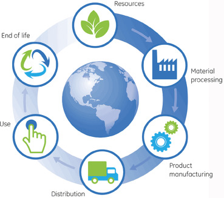
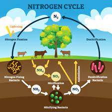
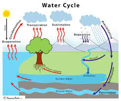
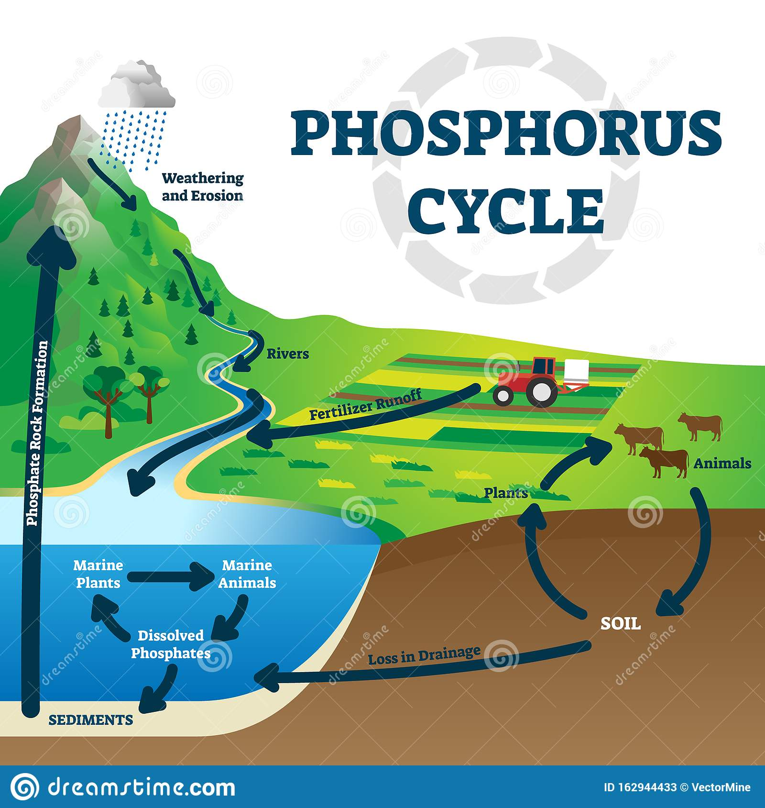
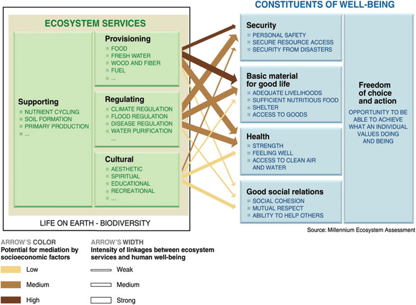
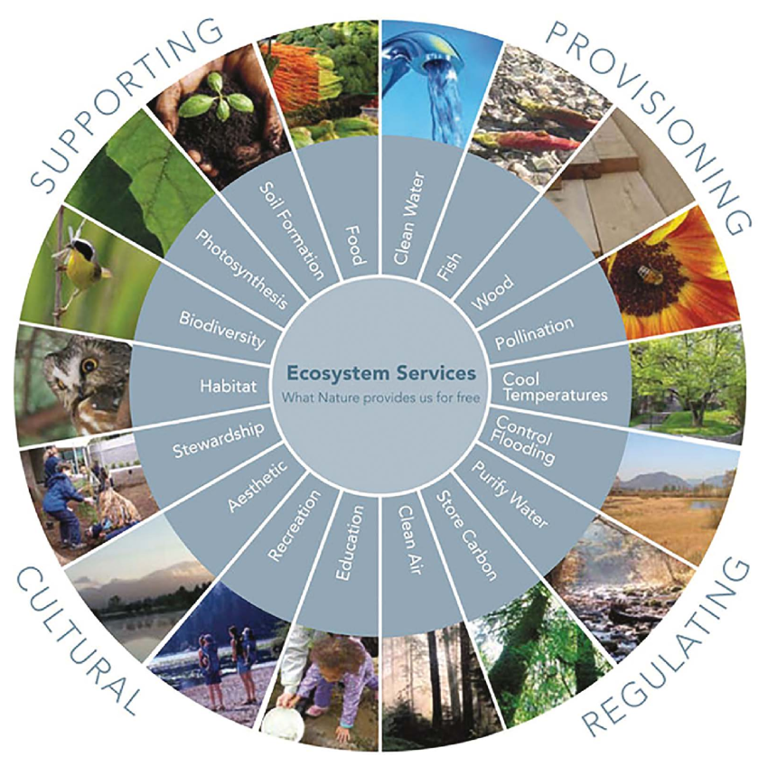

- [[natural resources]] - resources that exist without any actions of humans, _e.g._ sun, forest, minerals, animals, plants, air, oil, water, soil
	- we can choose to use them when you want.
	- renewable _versus_ non-renewable natural resources
		- renewable resources are solar energy, wind, trees, cows, water
			- renewable energy sources
				- does renewable equal sustainable?
					- related, but not equal
					- sustainable energy use ([[social-ecological systems]])
						- affordable
						- reliable
						- low to no CO2-emissions
						- safe for humans and the environment (green energy)
						- reasonable trade-offs (land use change, for example)
							- grow food, solar parks - what happens on the land?
							- context-dependent
						- energy independence (geopolitical)
				- wind, solar, hydro, and tidal power, geothermal energy, ambient heat captured by heat pumps
				- proposed EU policy: nuclear as a green energy source
				- [[green resources]] - resources which do not harm the environment
					- often determined via [[life cycle analysis]]
						- 
		- non-renewable are rocks, minerals
		- renewable resources won't run out within a human life
			- top soil - takes about 500 years to renew, renewable?
- [[ecosystem]] - consists of all the organisms (biotic) and the physical environment (abiotic) with which they interact
	- rainforest, savanna, coral reef, pond, desert, marine, lake
	- [[systems thinking]]
	- [[biome]] - looking at global ecosystems; large collection of flora and fauna occupying a major habitat
		- taiga, desert, steppe
	- biotic and abiotic components, comprising an ecosystem, are linked together through [[nutrient cycles]] and energy flows. Some nutrient cycles are special
		- Nitrogen cycle. All plants need nitrogen. N has gaseous phase, so circulation is pretty fast (as opposed to phosphorus cycle). Today effort goes into planting species that can sequester N into ground.
			- 
		- Water cycle. Solid, liquid phase, and gaseous. Interseting about hydrologic cycle is the trees (important for keeping cool), who help with evapotranspiration.
			- 
		- Phosphorus cycle. No gaseous phase. When P drains out into lakes, you have to manually get it out. Nature did it in the ice age by moving around rocks. Key nutrient for plant.
			- 
		- Carbon cycle. Crucial.
			- 
			- photosynthesis : 6 CO2 + 6 H2O -(light)--> C6H12O6 + 6 O2
			- energy enters the systems through photosynthesis and is incoporated into plant tissue
			- when Earth was very young, volcanos forced oxygen and carbon together to make carbon dioxide - so there was lots of CO2 in the atmosphere, plants evolved to make use of this and build carbohydrates
			- the evolution of vascular plants (408 - 360 million years ago)
				- the Devonian vascular plant "explosion", plants could grow high (more up than moss)
				- as plants covered the land, photosynthesis increased worldwide, started a decrease in CO2 levels by fixing carbon into both soil and sediments
			- Carboniferous period, 360 - 300 million years ago, named after underground coal deposits.
				- The growth of these forests removed huge amounts of CO2 from the atmosphere, from 4000 ppm  to 400 ppm ((closer to what it is today)), leading to an oxygen surplus (35%).
				- Size reached by insects and similar creatures is thought to be limited by the amount of air they are able to breathe, so they can get bigger now.
			- From 25% to 50% of Earth's vegetated lands has shown significant greening over the past 35 years.
				- Not sure if this is positive or negative yet.
				- Last ice age has redistributed carbon throughout the world through all the rock movement.
				- Ice age - 200 million years ago - CO2 was about 180 ppm. Plants that we eat today starve to death at about 150 ppm.
				- 40 - 50 years ago we were worried the Sahara would keep growing, world is now greening.
- Humans and our societies depend on the work of nature. [[ecosystem services]] - many and varied benefits that humans freely gain from the natural environment and from properly-functioning ecosystems; linking the work of nature to human wellbeing
	- 
	- classifying ecosystem services
		- [[Millennium Ecosystem Assessment]] (MA)
			- 
			- photosynthesis
		- [[Economics of Ecosystems and Biodiversity]] (TEEB)
			- for when you're trying for valuation
		- others
	- urban ecosystem services urbanisation - a driver of change
		- linking freshwater flows and ecosystem services  FIG 6
- Secretariat of the Convention on Biological Diversity. (2014). Cities and biodiversity outlook: Action and policy : a global assessment of the links between urbanization, biodiversity, and ecosystem services. https://www.deslibris.ca/ID/241668
	- ten key messages
	- social ecological urbanism (SEU) - [[institutions]] and [[urban form]] as tools for governing urban processes
	- integrating ecosystems into urban planning and design
	- promoting food security by integrating ecological information into urban planning
	- urban ES - promoting urban green related human health benefits
		- growing body of literature shows that more greenness close to where people live and better accessibility to green areas is useful for improving human health
	- urban areas and public health
		- cities are generally associated with lower levels of physical activity, which increases risks for a wide range of diseases such as those of cardiovascular origin and other non-communicable diseases.
		- while representing the most densely populated areas on the planet, cities also experience an increasing trend of mental illness, particularly linked to social isolation
		- health gap
			- health challenges tend to manifest themselves differently among different socioeconomic groups in society
			- groups with higher socioeconomic status tend to be correlated with better health than groups with lower socioeconomic status
			- health benefits provided by urban green areas have been shown to have proporti