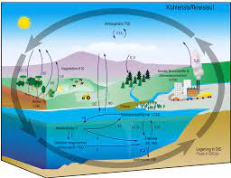

- [[ecosystem]] - consists of all the organisms (biotic) and the physical environment (abiotic) with which they interact
	- rainforest, savanna, coral reef, pond, desert, marine, lake
	- [[systems thinking]]
	- [[biome]] - looking at global ecosystems; large collection of flora and fauna occupying a major habitat
		- taiga, desert, steppe
	- biotic and abiotic components, comprising an ecosystem, are linked together through [[nutrient cycles]] and energy flows. Some nutrient cycles are special
		- Carbon cycle. Crucial.
			- 
			- photosynthesis : 6 CO2 + 6 H2O -(light)--> C6H12O6 + 6 O2
			- energy enters the systems through photosynthesis and is incoporated into plant tissue
			- when Earth was very young, volcanos forced oxygen and carbon together to make carbon dioxide - so there was lots of CO2 in the atmosphere, plants evolved to make use of this and build carbohydrates
			- From 25% to 50% of Earth's vegetated lands has shown significant greening over the past 35 years.
				- Not sure if this is positive or negative yet.
				- Last ice age has redistributed carbon throughout the world through all the rock movement.
				- Ice age - 200 million years ago - CO2 was about 180 ppm. Plants that we eat today starve to death at about 150 ppm.
				- 40 - 50 years ago we were worried the Sahara would keep growing, world is now greening.
- Humans and our societies depend on the work of nature. [[ecosystem services]] - many and varied benefits that humans freely gain from the natural environment and from properly-functioning ecosystems; linking the work of nature to human wellbeing
	- 
	- classifying ecosystem services
		- [[Millennium Ecosystem Assessment]] (MA)
			- 
			- photosynthesis
		- [[Economics of Ecosystems and Biodiversity]] (TEEB)
			- for when you're trying for valuation
		- others
	- urban ecosystem services urbanisation - a driver of change
		- linking freshwater flows and ecosystem services  FIG 6
- Secretariat of the Convention on Biological Diversity. (2014). Cities and biodiversity outlook: Action and policy : a global assessment of the links between urbanization, biodiversity, and ecosystem services. https://www.deslibris.ca/ID/241668
	- ten key messages
	- social ecological urbanism (SEU) - [[institutions]] and [[urban form]] as tools for governing urban processes
	- integrating ecosystems into urban planning and design
	- promoting food security by integrating ecological information into urban planning
	- urban ES - promoting urban green related human health benefits
		- growing body of literature shows that more greenness close to where people live and better accessibility to green areas is useful for improving human health
	- urban areas and public health
		- cities are generally associated with lower levels of physical activity, which increases risks for a wide range of diseases such as those of cardiovascular origin and other non-communicable diseases.
		- while representing the most densely populated areas on the planet, cities also experience an increasing trend of mental illness, particularly linked to social isolation
		- health gap
			- health challenges tend to manifest themselves differently among different socioeconomic groups in society
			- groups with higher socioeconomic status tend to be correlated with better health than groups with lower socioeconomic status
			- health benefits provided by urban green areas have been shown to have proportionally larger positive effects from lower socioeconomic groups, which are generally considered at higher risk of poverty-related stress and associated health issues
	- identifying areas of opportunity
		- locations where increasing accessibility to urban green areas will contribute the most to closing the health gap