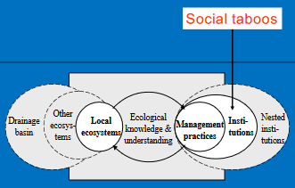

- institutions and property rights
	- [[institutions]] - rules and norms of society and their enforcement characteristics
	- regulatory structures for use and management of natural systems
		- formal
			- legal rules
			- written down
			- enforced by third-party authorities
			- costly to enforce
			- political rules, economic rules, contracts, laws, constitutions
		- informal
			- [[norms]] and conventions
			- unwritten codes for human conduct
			- enforced by social pressure/self-enforced
			- less costly to enforce
			- dress codes, family rules, taboos, rituals
	- property rights regimes
		- private property
		- state property
		- common property
		- open access
	- Property rights regimes are necessary but not
	  sufficient conditions for resource sustainability!
	  They help avoiding the [[tragedy of the 
	  commons]] that results from an inadequate specification of property rights to environmental services.
		- Hanna, S., Folke C. and Mäler, K.-G. Property Rights and Natural Resources. In Hanna, S., & Munasinghe, M. (Eds.). (1995). Property rights and the environment: Social and ecological issues. Beijer International Institute of Ecological Economics and the World Bank.
		- Tragedy of the commons
			- Picture a pasture open to all... the rational herdsman concludes that the only sensible course for him to pursue is to add another animal to his herd... the conclusion reached by each and every rational herdsman sharing a commons. Therein is the tragedy. Each man is locked into a [[system]] that compels him to increase his herd without limit-in a world that is limited. Ruin is the destination toward which all men rush, each pursuing his own best interest in a society that believes in the freedom of the commons. Freedom of the commons brings ruin to all (Hardin 1968).
			- Elinor Ostrom showed that Hardin’s example of a commons is in fact an open access system – a system without norms and rules.
		- Three general principles of property rights.
			- 1. Property rights regimes do not exist as two opposing types but rather as combinations along a spectrum from open access to private ownership.
			- 2. Property rights regimes are not in themselves sufficient conditions for resource sustainability, but they are necessary conditions. If the assurance to future claims to resource benefits is absent, no incentive exists to limit current use.
			- 3. No single type of property rights regime can be prescribed as a remedy for problems of resource degradation and overuse. Both effective control and ineffective control can exist under any kind of regime.
			- In addressing environmental problems, policy must not only focus on the establishment of property rights regimes, but also carefully consider the context in which property rights regimes are to be placed and the extent to which they are
			  enforceable.
			- Without clearly specified property rights, environmental resources cannot be sustained over time.
			- Hanna, S., Folke C. and Mäler, K.-G. Property Rights and Natural Resources. In Hanna, S., & Munasinghe, M. (Eds.). (1995). Property rights and the environment: Social and ecological issues. Beijer International Institute of Ecological Economics and the World Bank.
	- Institutions determine when, where, how, and how much resources can be taken.
	- Common property systems
		- users manage resources together as a group
		- users can exclude people not belonging to the group/community
		- users create their own [[institutions]] to manage resources (predominance of informal institutions)
- social taboos in traditional resource management
	- 
	- taboo - prohibition imposed by social custom or as a protective measure
	- social functions
		- to differentiate between profane and sacred entities
		- psychological reasons
		- mark group-adherence
		- classification function
	- resource and habitat taboos
		- temporal taboos
		- method taboos
		- life-history taboos
			- roosting fruitbats
		- segment taboos
		- specific species taboos
		- habitat taboos
			- forests
			- coast lines
			- coral reefs
			- rivers
			- ponds
	- ecological functions of taboos
		- protect ecosystems/habitats
		- maintain ecosystem services
		- protect threatened species
- urban green commons
	- physical green spaces in urban settings of diverse land ownership that depend on collective organisation and management and to which individuals and interest groups participating in management hold a rich set of bundles of rights, including rights to craft their own institutions and to
	  decide whom they want to include in such management schemes
		- Colding, J., & Barthel, S. (2013). The Potential of ‘Urban Green Commons’ in the Resilience Building of Cities. Ecological Economics, 86, 156–166. https://doi.org/10.1016/j.ecolecon.2012.10.016 #coldingPotentialUrbanGreen2013
	- critical feature of UGCs is that it allows for management of land for urban residents
		- Colding, J., & Barthel, S. (2013). The Potential of ‘Urban Green Commons’ in the Resilience Building of Cities. Ecological Economics, 86, 156–166. https://doi.org/10.1016/j.ecolecon.2012.10.016 #coldingPotentialUrbanGreen2013
	- represent urban biodiversity hotspots
		- Borysiak et al. 2016; Cabral et al. 2017; Speak et al. 2
	- promotes collaborative urban planning and co-creation of cities
		- Healy 1997; Sanecka-Wojda 2017
	- reduces management costs of green areas (depends on voluntary management and self-interest of the users)
		- Colding 2011
	- builds social capital among different groups and people (Oddsberg 2011; Speak et al. 2015)
	- alternative to land privatisation
		- Colding 2011, colding et al 2013