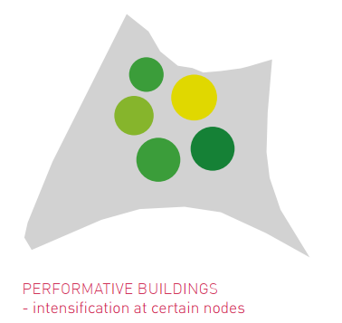

- [[tool]] used when you want to intensify or condense a public or ecological service that in itself interacts with the technical, programmatic and aesthetic functions of a building. #definition
	- 
	- Barthel, S., Colding, J., Ernstson, H., Erixon, H., Grahn, S., Kärsten, C., Marcus, L. H., & Torsvall, J. (2013). _Principles of social-ecological urbanism: Case study: Albano Campus, Stockholm_. Architecture and Built Environment, KTH. #barthelPrinciplesSocialEcologicalUrbanism2013
- [[active ground]]
- [[green artery]]